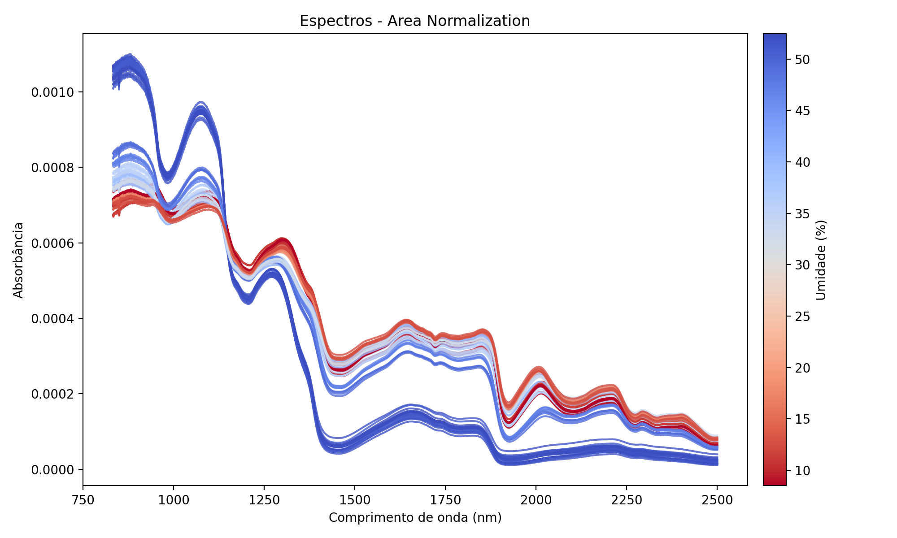
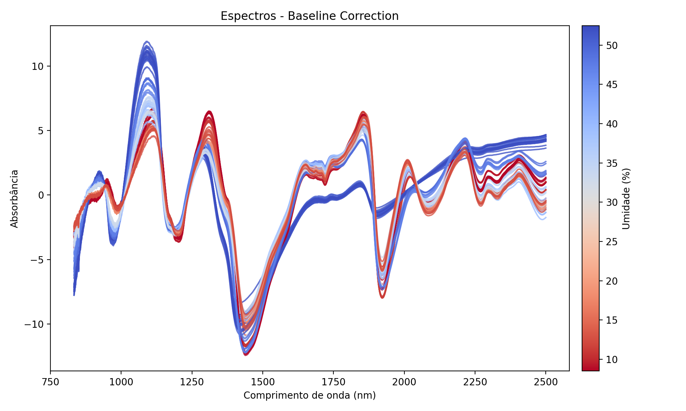
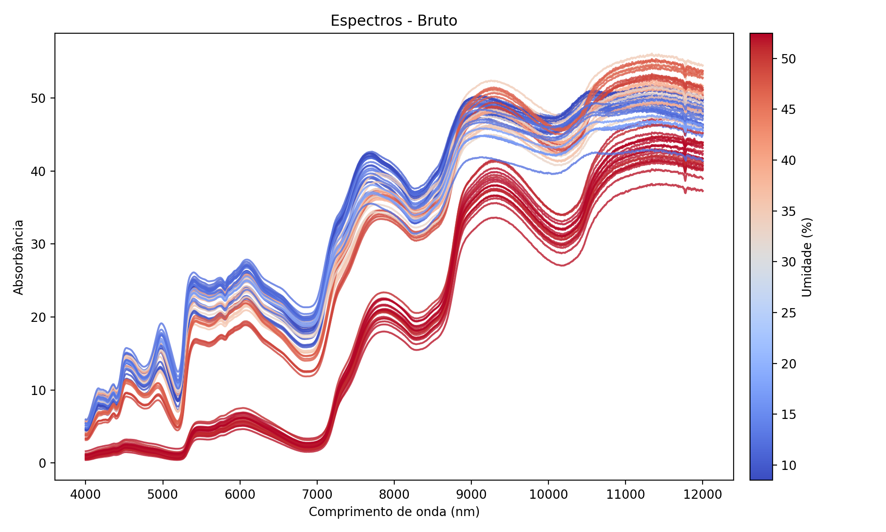
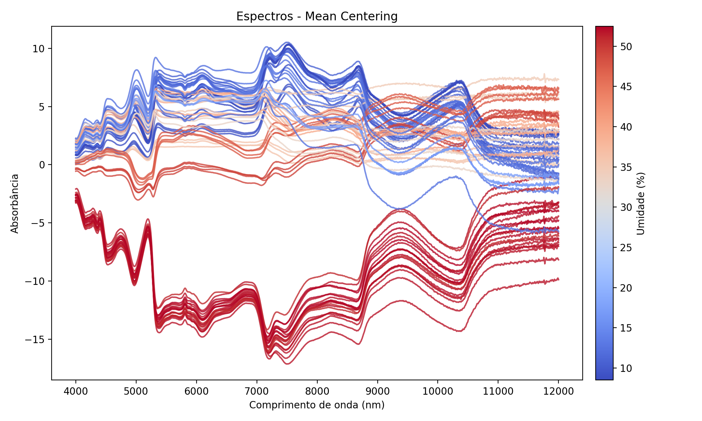
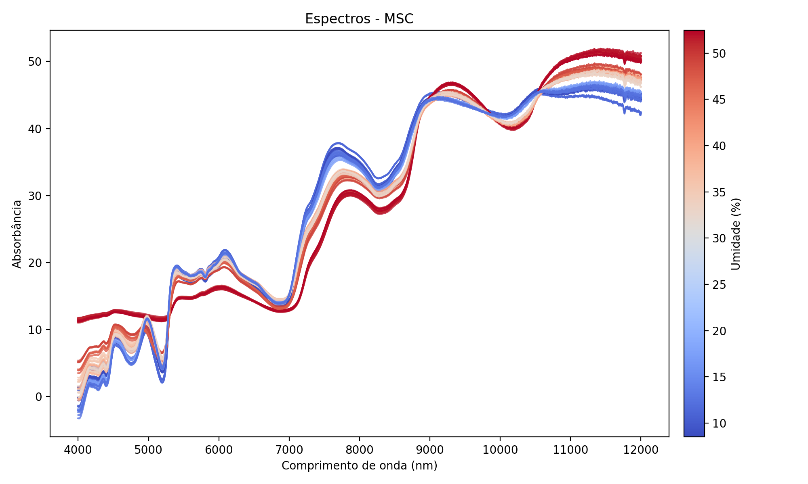
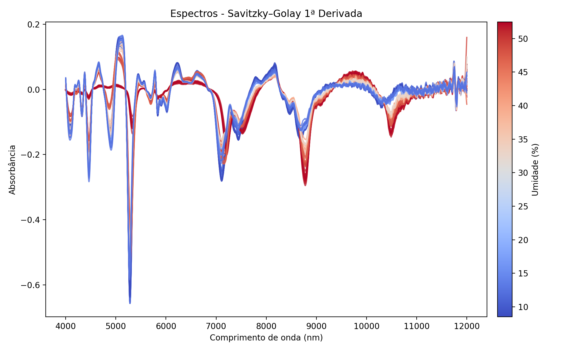
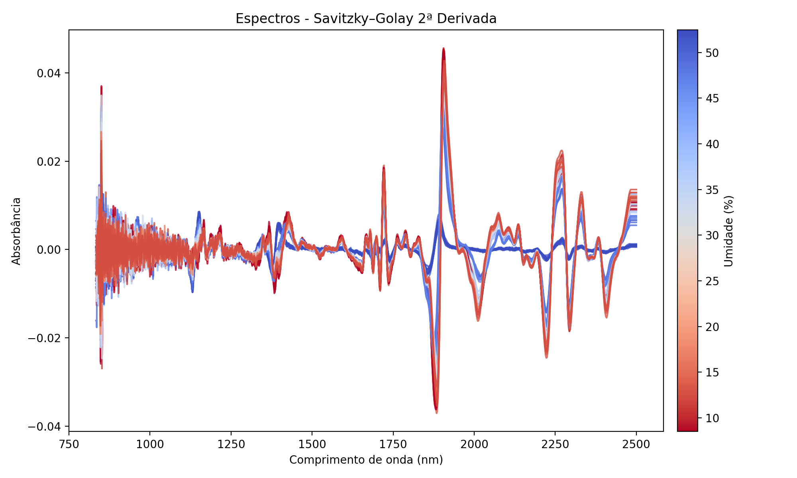
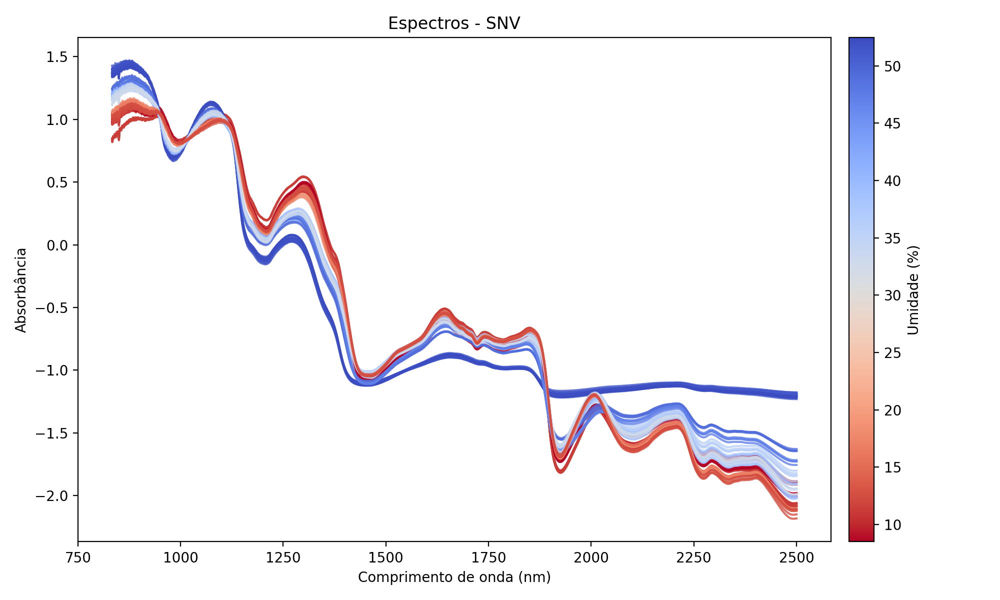

# Coffee NIR Moisture

Pipeline em Python para **pré-processamento de espectros NIR** de amostras de café e **treinamento de modelos de regressão** para previsão de teor de umidade.

## Objetivos do projeto

1. Organizar em um único fluxo o tratamento de espectros NIR de café.
2. Aplicar pré-processamentos espectrais padronizados e reproduzíveis.
3. Treinar e comparar diferentes modelos de regressão para prever umidade:
   - Partial Least Squares (PLS)
   - Random Forest Regressor
   - Support Vector Regression (SVR)
   - Perceptron Multicamadas (MLP)

## Passo a Passo do Pipeline

O pipeline foi projetado para ser modular e sequencial. Abaixo está a descrição exata do que ocorre em cada etapa da execução:

### 1. Pré-processamento (`preprocessing/`)

Esta etapa é responsável por transformar os dados brutos em matrizes prontas para o treinamento dos modelos.

1.  **Leitura dos Dados**:
    - O script carrega o arquivo de espectros (`dados_brutos.csv`) e o arquivo de referência (`moisture.csv`).
    - **Limpeza de IDs**: Os identificadores das amostras são padronizados (removendo espaços, convertendo para maiúsculas) para garantir que o cruzamento dos dados funcione corretamente.

2.  **Fusão (Merge)**:
    - As tabelas de espectros e umidade são unidas (join) usando o ID da amostra como chave. Amostras sem referência de umidade são descartadas automaticamente.

3.  **Geração de Datasets (Transformações)**:
    O pipeline aplica 8 estratégias diferentes de pré-processamento aos espectros originais. Para cada estratégia, um arquivo `.csv` separado é salvo na pasta `output/preprocessed/datasets/`.
    
    As transformações aplicadas são:
    - **Bruto**: Nenhuma alteração nos dados.
    - **Savitzky-Golay (1ª Derivada)**: Realça picos e remove offsets constantes (Janela: 15, Polinômio: 2).
    - **Savitzky-Golay (2ª Derivada)**: Remove tendências lineares e separa picos sobrepostos (Janela: 15, Polinômio: 2).
    - **Correção de Linha de Base (Baseline Correction)**: Ajusta um polinômio de grau 2 para remover a inclinação da linha base.
    - **Mean Centering**: Subtrai a média global de cada comprimento de onda, centralizando os dados no zero.
    - **MSC (Multiplicative Scatter Correction)**: Corrige efeitos de espalhamento de luz, linearizando cada espectro em relação a um espectro médio de referência.
    - **SNV (Standard Normal Variate)**: Normaliza cada espectro individualmente (subtrai a média e divide pelo desvio padrão do próprio espectro).
    - **Normalização por Área**: Divide cada ponto do espectro pela área total sob a curva, normalizando a intensidade global.

4.  **Visualização**:
    - Para cada transformação, um gráfico é gerado e salvo em `output/preprocessed/plots/` para inspeção visual da qualidade do sinal.

### 2. Modelagem e Avaliação (`modeling/`)

Após o pré-processamento, o pipeline de modelagem entra em ação. Ele itera sobre **cada um** dos datasets gerados acima.

1.  **Carregamento do Dataset**:
    - O script lê um dos arquivos CSV pré-processados (ex: `dados_snv.csv`).

2.  **Divisão Treino/Validação (Kennard-Stone)**:
    - Em vez de sortear as amostras aleatoriamente, o algoritmo **Kennard-Stone** é utilizado.
    - Ele calcula a distância euclidiana entre as amostras e seleciona as mais distantes para compor o conjunto de **Treino**.
    - As amostras restantes formam o conjunto de **Validação**.
    - Isso garante que o modelo seja treinado com a maior variabilidade espectral possível, tornando-o mais robusto.

3.  **Treinamento Multi-Algoritmo**:
    Para o dataset atual, 4 algoritmos de regressão são treinados. Para cada um, é feita uma busca pelos melhores hiperparâmetros (**Grid Search**):

    - **PLS (Partial Least Squares)**:
        - `n_components`: [2, 4, 8, 12] (Número de variáveis latentes).
        - `scale`: [False, True] (Se deve escalonar as variáveis com desvio padrão unitário).
    - **Random Forest**:
        - `n_estimators`: [100, 300] (Número de árvores na floresta).
        - `max_depth`: [None, 10, 20] (Profundidade máxima da árvore).
        - `min_samples_split`: [2, 5] (Mínimo de amostras para dividir um nó).
        - `min_samples_leaf`: [1, 2] (Mínimo de amostras em um nó folha).
        - `max_features`: ["sqrt", "log2"] (Número de features a considerar em cada divisão).
        - `bootstrap`: [True, False] (Se deve usar amostras de bootstrap).
    - **SVR (Support Vector Regression)**:
        - `kernel`: ["rbf"] (Kernel de Base Radial).
        - `C`: [1.0, 10.0, 100.0] (Parâmetro de regularização).
        - `gamma`: ["scale", "auto"] (Coeficiente do kernel).
        - `epsilon`: [0.01, 0.1] (Margem de tolerância do erro).
    - **MLP (Redes Neurais)**:
        - `hidden_layer_sizes`: [(50,), (100,), (50, 50)] (Arquitetura das camadas ocultas).
        - `activation`: ["relu", "tanh"] (Função de ativação).
        - `alpha`: [1e-4, 1e-3] (Penalidade L2 / Regularização).
        - `learning_rate_init`: [1e-3, 1e-2] (Taxa de aprendizado inicial).
        - `max_iter`: [5000, 10000] (Número máximo de iterações).
        - `tol`: [1e-4, 1e-3] (Tolerância para otimização).

4.  **Validação Cruzada (Cross-Validation)**:
    - Durante o Grid Search, cada combinação de parâmetros é avaliada usando **5-fold Cross-Validation** no conjunto de treino. Isso evita o overfitting (ajuste excessivo) aos dados de treino.

5.  **Avaliação Final e Salvamento**:
    - O melhor modelo encontrado é retreinado com todos os dados de treino.
    - Ele é então testado no conjunto de **Validação** (que nunca "viu" durante o treino).
    - As métricas de performance são calculadas:
        - **RMSE** (Erro médio quadrático): Quanto menor, melhor.
        - **MAE** (Erro absoluto médio): Média dos erros absolutos.
        - **R²** (Coeficiente de determinação): Quanto mais próximo de 1, melhor.
        - **RPD**: Relação entre desvio padrão e erro. RPD > 2.5 indica bons modelos para quantificação.
    - O modelo final é salvo em formato `.joblib` na pasta `output/models/`.
    - Um arquivo CSV com o ranking de todos os modelos testados é gerado.


```text
coffee-nir-moisture/
├── data/
│   └── raw/                       # Dados brutos (espectros, referências de umidade, etc.)
├── preprocessing/                 # Módulos com loaders, transforms e utilitários do pipeline
│   ├── pipeline.py                # Orquestrador do fluxo de pré-processamento
│   └── loaders|transforms|utils   # Componentes reutilizáveis do pipeline
├── main.py                        # Script principal para executar o pipeline
├── modeling/                      # Espaço reservado para futuros modelos de regressão
├── output/
│   ├── preprocessed/
│   │   ├── datasets/              # Espectros transformados/exportados
│   │   └── plots/                 # Visualizações das etapas de pré-processamento
│   └── models/                    # Diretório para salvar checkpoints de PLS, RF, SVR, MLP, etc.
├── requirements.txt               # Dependências Python
└── .gitignore 
```

## Pré-processamento de Espectros

Abaixo estão os gráficos gerados para cada técnica de pré-processamento aplicada aos espectros NIR:

```text
Diretório: coffee-nir-moisture/output/preprocessed/plots
```

**Área Normalizada**  


**Correção de Linha de Base**  


**Espectros Brutos**  


**Centralização pela Média**  


**Multiplicative Scatter Correction (MSC)**  


**Derivada 1ª ordem (Savitzky-Golay)**  


**Derivada 2ª ordem (Savitzky-Golay)**  


**Standard Normal Variate (SNV)**  

